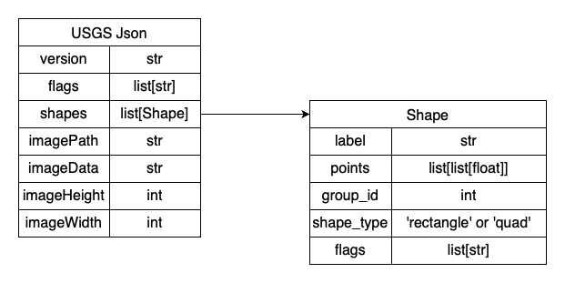
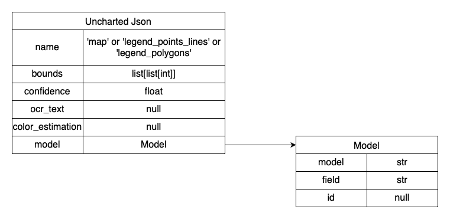

# CriticalMAAS Pipeline
This is the internal UIUC git repository for the DARPA CMAAS inference pipeline. The pipeline is designed to be run on hydro.

## Quickstart

<details>
<summary> Installing </summary>

  To get started with this pipeline you will need to clone the repository. We recommend using python venv here to keep the working environment clean.

  ```bash
  git clone https://github.com/DARPA-CRITICALMAAS/uiuc-pipeline.git

  cd uiuc-pipeline
  ```

  If you are on hydro for the first time, you will need to load the anaconda3_gpu module and create a new conda environment. If conda is already installed on your system, you can skip these two lines.

  ```bash
  module load anaconda3_gpu
  conda init
  ```

  This repository also makes use of submodules which need to be initialized and updated.

  ```bash
  git submodule init
  git submodule update
  ```

  We now create new conda and venv environments and install the [requirements.txt](https://git.ncsa.illinois.edu/criticalmaas/pipeline/-/blob/abode_pipeline/requirements.txt).

  ```bash
  conda create --name CMAAS_py_3.10 python=3.10
  conda activate CMAAS_py_3.10
  python3 -m venv venv
  source venv/bin/activate
  # submodule must be updated before installing the requirements
  pip install -r requirements.txt
  ```


</details>

<details>
<summary> Understanding Pipeline Inputs </summary>

  To perform inference with our pipeline, only one data input is required and that is the map that you want to perform inference on. There are other data inputs we can use to speed up and perform optional steps with. Each of these optional inputs needs to be structured so that the name is consistent with the input map. E.g. if you have `CA_Sage.tif` the legend will need be named `CA_Sage.json`

  This is visualization of what that structure looks like.
  ```bash
  data
  ├── Map_1.tif
  ├── Map_2.tif
  ├── ...
  └── Map_N.tif

  legends # Optional
  ├── Map_1.json
  ├── Map_2.json
  ├── ...
  └── Map_N.json

  layouts # Optional
  ├── Map_1.json
  ├── Map_2.json
  ├── ...
  └── Map_N.json

  validation # Optional
  ├── Map_1_lgd_1_poly.tif
  ├── Map_1_lgd_2_poly.tif
  ├── ...
  ├── Map_1_lgd_N_poly.tif
  ├── ...
  ├── Map_N_lgd_1_poly.tif
  ├── Map_N_lgd_2_poly.tif
  ├── ...
  └── MapN_lgdN_poly.tif
  ```
  It is also important to note that if you specify `--legends` and there is no corresponding legend for a map file, that is completely fine. Pipeline will just fallback to generating a legend for that specfic map. The same is true for `--layouts` and `--validation`.

</details>

<details>
<summary> Performing Inference </summary>

  To perform inference with one of our models, we will need to run pipeline.py. Pipeline.py has 3 core required arguments to run:

  * --model  : The model to use for inference.
  * --data   : Directory containing data to perform inference on.
  * --output : Directory to save the output data of the pipeline to.

  The list of available models can be found [below](#available-models) with the release-tag being what you want to use for the argument.

  _*Note that you must have a GPU available to run pipeline.py_

  ```bash
  # Example call to pipeline.py
  python pipeline.py --model "golden_muscat" --data mydata/images/ --output mydata/output/
  ```
  Running this will have "golden-muscat" run inference on every `.tif` file in the directory specifed by `--data`. The output rasters of this inference will then be saved as `.tif`s to the directory specifed by `--output` along with a geopackage file for each map. The geopackage file contains vector data for each legend item in the map. Output is saved as the pipeline runs so even if the pipeline were to crash in the middle of running, all maps that ran before the crash will have been saved.

  By default the pipeline will save logging information to `logs/Latest.log` this can be useful if you have any problems or want to see a detailed view of what the pipeline is doing. You can also change the log file location with `--log`.

  For the further documentation on all the pipeline options see [below](#pipeline-parameters).

</details>

<details>
<summary> Running on Hydro </summary>

  For running the pipeline on hydro there are two options. You can manually run the pipeline with an interactive srun session or we can submit an automatic job using sbatch. You can learn how to manually run with srun in the [hydro docs](https://docs.ncsa.illinois.edu/systems/hydro/en/latest/user-guide/running-jobs.html#srun).
  You will need to make sure to srun with `--partition=a100` flag as these are the only nodes with GPUs on hydro.

  For running with sbatch we have two scripts `submit.sh` and `start_pipeline.sh`. When we run `submit.sh` that script will automatically start `start_pipeline.sh` on an a100 node. 

  First, we will want to set the parameters for pipeline.py in `start_pipeline.sh`. Then, once we are ready to run, all we have to do is call
  ```bash
  sbatch submit.sh
  ```
  and that will start the job. We can view our pipelines progess by looking at `logs/job_%yourjobid%.log`. The slurm logs can also be found at `logs/slurm/%yourjobid%.e` if you have any errors.

  **Hint `tail -f logs/job_%yourjobid%.log` can be very useful for viewing these logs.
  You can also use `nvitop` when on the node that is running the job to view GPU statistics in real-time.*

  **Please note that our job script assumes that you are using venv to setup your environment. If you are using another python environment manager, E.g. Conda or virtualenvwrapper, you will need to adapt the start_pipeline.sh script to your setup.*

</details>

<details>
<summary> Understanding Pipeline Outputs </summary>

  Pipeline can produce quite a few output files so it can be important to understand what each is. The key arguments here ar `--output` and `--feedback` as they control what files the pipeline will output and where. `--output` controls where the results of inference will get saved; A Raster tif for each legend and a geopackage for each map containing the vectorized legend data for every legend. `--feedback` controls whether the pipeline will output files that are intended for debugging. When feedback is enabled, the pipeline will save any legend data that was generated by the pipeline, save the image of the legend label, create a visualization image for each legend analyzed in the validation step, and save the validation score csv for each individual map. This results in the following output structure.

  ```bash
  output
  ├── full_dataset_scores.csv # If validation was enabled and feedback was not
  ├── Map1_lgd1.tif
  ├── ...
  ├── Map1_lgdN.tif
  ├── Map1.gpkg
  ├── ...
  ├── MapN_lgd1.tif
  ├── ...
  ├── MapN_lgdN.tif
  └── MapN.gpkg

  feedback
  ├── full_dataset_scores.csv # If validation was enabled
  ├── Map1
  │   ├── Map1.json # If a map legend was generated by pipeline
  │   ├── Map1_Scores.csv   # If validation was enabled
  │   ├── lgd_map1_lgd1.tif # Legend label image
  │   ├── ...               # ''
  │   ├── lgd_map1_lgdN.tif # ''
  │   ├── val_map1_lgd1.tif # Legend validation image
  │   ├── ...               # ''
  │   └── val_map1_lgdN.tif # ''
  ├── ...
  └── MapN
      ├── MapN.json # If a map legend was generated by pipeline
      ├── MapN_Scores.csv   # If validation was enabled
      ├── lgd_mapN_lgd1.tif # Legend label image
      ├── ...               # ''
      ├── lgd_mapN_lgdN.tif # ''
      ├── val_mapN_lgd1.tif # Legend validation image
      ├── ...               # ''
      └── val_mapN_lgdN.tif # ''
  ```

  Note that if feedback is not turned on and validation is, pipeline will still save all the scores in the output directory to `#%data%_results.csv`

</details>

## FAQ
Q. Where is data on hydro?

A. `/projects/bbym/shared/data`

Q. I've updated to the latest pipeline commit and it doesn't work.

A. New requirements could have been added or submodules could have been updated. It's always a good idea to run the following commands if you are having issues after updating to the most recent commit.

```bash
pip install -r requirements.txt
git submodule init
git submodule update
```

Q. I'm having a problem with the pipeline that I couldn't find help for.

A. Use the issues tab underneath the Plan tab to submit an issue describing your problem.

## Documentation

### Pipeline Parameters

* **--model** : required<br>
    The release-tag of the model checkpoint that will be used to perform inference. Available release-tags for models are listed [below](#available-models) and can be displayed with --help.
* **--data** : required<br>
    Path to file(s) and/or directory(s) containing the data to perform inference on. The program will run inference on any `.tif` files. Mutually exclusive with --amqp.
* **--amqp** : required ## Not Implemented Yet ##<br>
    Url to use to connect to a amqp data stream. Mutually exclusive with --data. 
* **--output** : required<br>
    Directory to save the outputs of inference to. These output currently include the predicted raster for each legend item of each map and geopackage file for each map which contains all of the layer in vector format. If the directory does not exist, it will be created. ***Geopackage saving is disabled as there is currently a bug when saving**
* **--legends** : optional<br>
    Optional Directory containing precomputed legend data in [USGS json format](#usgs-json-format). If option is provided, the pipeline will use the precomputed legend data instead of generating its own. File names are expected to match their corresponding map file name. E.g. a file named `data/CA_Sage.tif` would have a `legends/CA_Sage.json` file. This can increase pipeline performance by skipping the legend extraction step.
* **--layouts** : optional<br>
    Optional Directory containing precomputed map layout data in [Uncharted json format](#uncharted-json-format). If option is provided, pipeline will use the layout to assist in legend extraction and inferencing. File names are expected to match their corresponding map file name. E.g. a file named `data/CA_Sage.tif` would have a `layouts/CA_Sage.json` file. This can significantly increase the performance of the pipeline.
* **--validation** : optional<br>
    Optional Directory containing the true raster segmentations. If option is provided, the pipeline will perform the validation step (Scoring the results of predictions) with this data. File names are expected to match their corresponding map file name and legend. E.g. if there is a legend for map CA_Sage called Mbv_poly, the validation directory would have a `validation/CA_Sage_Mbv_poly.tif` file.
* **--feedback** : optional<br>
    Optional Directory to save feedback on the pipeline. If option is provided, pipeline will save any legend data that was generated by the pipeline, the legend label image, visualization images of the validation step, and validation score csv's for each map. If the directory does not exist, it will be created. This option will incur a slight performance hit on the pipeline.
* **--feature_type** : optional<br>
    Option to specify which type of feature the pipeline should run on. Available feature types are Point, Polygon and All. Defaults to polygon
* **--log** : optional<br>
    Option to set the file that pipeline logging will write to. Defaults to "logs/Latest.log".
* **--verbose, -v** : optional<br>
    Flag to change the default logging level. Changes the file logging level from INFO to DEBUG and the Console level from WARNING to INFO.

[//]: # (* **--config** : optional ## Not implemented yet ##<br>
    The config file to use for the pipeline. Not implemented yet)

[//]: # (* **--gpu** : optional <br> The number of the gpu to use, mostly for use with amqp NOTE this is NOT the number of gpus that will be used but rather which one to use)

### Pipeline Config # Not implemented yet 
Pipeline config will likely contain model-specific config options. Some planned options are below.
* Patch_size
* Patch_overlap
* Batch_size?

### Available Models
#### Point Models

<details>
<summary> <b>Flat-Iceberg</b> </summary>

Git Repository : https://github.com/Dongjiahua/DARPA_torch <br>
Lead Developer : [ Dong Jiahua](https://github.com/Dongjiahua)<br>
Description : Legend Image promptable point detection model<br>

Release Tags :<br>
* flat_iceberg

</details>

<details>
<summary> <b>Drab-Volcano</b> </summary>

Git Repository : https://github.com/Dongjiahua/DARPA_torch/tree/drab_volcano <br>
Lead Developer : [ Dong Jiahua](https://github.com/Dongjiahua)<br>
Description : Pre-trained point detection model, works on a predefined set of point types.<br>

Release Tags :<br>
* drab_volcano

</details>

#### Polygon Models
<details>
<summary> <b>Golden-Muscat</b> </summary>

Git Repository : https://github.com/xiyuez2/Darpa_Unet_Release <br>
Lead Developer : [ xiyuez2](https://github.com/xiyuez2)<br>
Description : U-net model<br>

Release Tags :<br>
* golden_muscat

</details>

<details>
<summary> <b>Rigid-Wasabi</b> </summary>

Git Repository : https://github.com/xiyuez2/Darpa_Unet_Release <br>
Lead Developer : [ xiyuez2](https://github.com/xiyuez2)<br>
Description : U-net model<br>

Release Tags :<br>
* rigid_wasabi

</details>

<details>
<summary> <b>Blaring-Foundry</b> </summary>

Git Repository : https://github.com/xiyuez2/Darpa_Unet_Release <br>
Lead Developer : [ ziruiwang409](https://github.com/ziruiwang409)<br>
Description : Superpixel U-net model<br>

Release Tags :<br>
* blaring_foundry

</details>

### Appendix

#### USGS Json format 
The current version of the USGS json format closely follows same format as the one used for the CMA competition, but now the shape_type field indicates whether there are 2 points (rectangle) or 4 points (quad) to describe the bounding box.



Current as of Jan 2024

#### Uncharted Json format
The Uncharted Json format is based on the TA1 schema (i.e., list of PageExtraction schema objects) and has three segmentation classes which each contain a bounding contour:
  * map -- the main map region
  * legend_polygons -- legend region for polygon features
  * legend_points_lines -- legend region for point and/or line features



Current as of Jan 2024